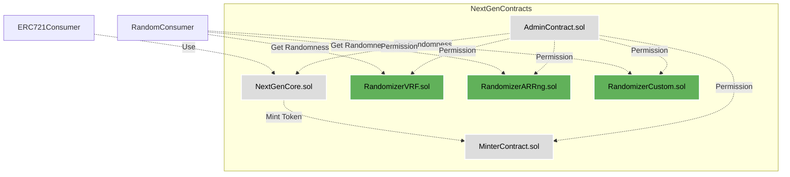

## Overview

NextGen is a modular and extensible system for launching generative art NFT projects on Ethereum. It consists of a core ERC-721 token contract, minter contract, admin contract, and various randomizer contracts. 

## SCOPE

| Contract                           | Purpose                                                                                                           | Libraries and Interfaces used                                                                                        |
|------------------------------------|------------------------------------------------------------------------------------------------------------------|----------------------------------------------------------------------------------------------------------------------|
| smart-contracts/NextGenCore.sol    | Core is the contract where the ERC721 tokens are minted and includes all the core functions of the ERC721 standard as well as additional setter & getter functions. | ERC721Enumerable, Ownable, Strings, Base64, ERC2981, IRandomizer, INextGenAdmins, IMinterContract                   |
| smart-contracts/MinterContract.sol | The Minter contract is used to mint an ERC721 token for a collection on the Core contract based on certain requirements that are set prior to the minting process.   | INextGenCore, Ownable, IDelegationManagementContract, MerkleProof, INextGenAdmins, IERC721                           |
| smart-contracts/NextGenAdmins.sol  | The Admin contract is responsible for adding or removing global or function-based admins who are allowed to call certain functions in both the Core and Minter contracts. | Ownable                                                                                                              |
| smart-contracts/RandomizerNXT.sol  | The RandomizerNXT contract is responsible for generating a random hash for each token during the minting process using the NextGen's proposed approach.          | IXRandoms, INextGenAdmins, Ownable, INextGenCore                                                                     |
| smart-contracts/RandomizerVRF.sol  | The RandomizerVRF contract is responsible for generating a random hash for each token during the minting process using the Chainlink's VRF service.           | VRFCoordinatorV2Interface, VRFConsumerBaseV2, Ownable, INextGenCore, INextGenAdmins                                    |
| smart-contracts/RandomizerRNG.sol  | The RandomizerRNG contract is responsible for generating a random hash for each token during the minting process using the ARRng.io service.               | ArrngConsumer, Ownable, INextGenCore, INextGenAdmins                                                                |
| smart-contracts/XRandoms.sol       | The randomPool smart contract is used by the RandomizerNXT contract, once it's called from the RandomizerNXT smart contract it returns a random word from the current word pool as well as a random number back to the RandomizerNXT smart contract which uses those values to generate a random hash. | Ownable                                                                                                              |
| smart-contracts/AuctionDemo.sol    | The auctionDemo smart contract holds the current auctions after the mintAndAuction functionality is called. Users can bid on a token and the highest bidder can claim the token after an auction finishes. | IMinterContract, IERC721, INextGenAdmins, Ownable                                                                   |

## Architecture

The architecture follows a separation of concerns design pattern, with each component handling a specific role:


**Benefits**

- Modularity makes components easily swappable 
- Separation of roles improves security
- Loose coupling enhances flexibility

**Recommendations**

- Use interface inheritance over implementation inheritance where possible
- Avoid overly complex inter-contract function calls
- Document architectural decisions and tradeoffs

Diagram showing the architecture and component interactions of the NextGen smart contract system:



**In this diagram:**

- The core components of NextGen - Core, Minter, Admin contracts
- Different Randomizer contracts for getting randomness
- Consumers of the system like ERC721 apps and random consumers
- Interactions like minting tokens, getting randomness, and admin permissions

The components are grouped into colored boxes based on their role.

I provide a high-level overview of the architecture and how the different pieces fit together to form the overall system.

## Details on some potential vulnerabilities I discovered:

**Access Controls**

- **Owner transfer risk** - The current owner of the Admin contract could maliciously call `transferOwnership` to assign a malicious actor as the new owner. This would give them authority over critical functions. The use of a multi-sig wallet or timelock would prevent unilateral transfers.

- **Artist address change** - Even after the collection is frozen, the artist address could be changed by calling `setCollectionData` again. An extra check that `artistSigned == true` is needed to prevent this.

- **Modifier checks** - Custom modifiers like `AdminRequired` encapsulate authority checks. But we can't rely on them alone. Functions should also check `msg.sender` in the body to be more robust.

- **Delegate minting** - If limits are placed on delegated mints per address, a user could try to exploit multiple delegate permissions to mint more than their allotted amount. Capping total delegated mints would prevent this.

**Payments**

- **emergencyWithdraw role** - The admin owner could drain funds via `emergencyWithdraw`. This role needs to be revoked after initial setup. Timelock or multisig would also mitigate this risk.

- **Payment redirection** - Accepted artist payment splits could later be redirected by updating addresses and percentages. A locking mechanism is needed after splits are accepted.

- **Wallet compatibility** - Some wallets like Gnosis Safe don't handle native ETH well. Payment calls could be wrapped in try/catch and resend ETH on revert.

**Sales Models** 

- **Rate validation** - If the rate passed to `setCollectionCosts` is incorrect, it could lead to prices much higher/lower than intended. Input validation on rate is important.

**Randomness**

- **Balance checks** - Lack of funds would prevent **Chainlink/ARRng** requests, blocking mints. Contracts should check balances before requesting randomness.

- **Access control** - `setTokenHash` could be called directly instead of via Randomizer. Access control prevents this manipulation. 

**Metadata** 

- **Frozen metadata** - If collection freeze check is missing from `changeTokenData`, frozen metadata could still be altered. Proper check prevents this.

**Admin Contract**

- **updateAdminContract risk** - Multisig or timelock on this function prevents unauthorized replacement of the critical Admin contract.

- **Permission revocation** - Ability to upgrade Admin contract should be revoked after initial setup is complete.

## Contract Analysis

### NextGenCore

This is the main ERC-721 token contract. It handles metadata, minting, burning, and main collection variables.

**Code Quality**

- Follows OpenZeppelin standards and best practices
- Well commented with clear variable names
- Heavy use of mappings over arrays for efficiency
- Modifiers properly protect sensitive functionality

**Example Function**

The `mint` function shows excellent validation, access control, and events:

```solidity
function mint(
  uint256 mintIndex, 
  address _mintingAddress,
  // ...
  ) external {

  require(msg.sender == minterContract, "Caller is not Minter");
  
  // Various mint index and circulation validations
  
  gencore.mint(mintIndex, _mintTo, _tokenData, _saltfun_o, _collectionID, phase);

  // Update circulation counts

  emit Mint(mintIndex, _mintTo); 

}
```

**Recommendations**

- Consider using events consistently for important state changes
- Add natspec comments to make functions more self-documenting
- Use a bitmap for tracking various collection booleans rather than separate mappings

### MinterContract

This contract handles all minting logic and sale models. It is the only authorized minter of Core tokens.

**Code Quality**

- Very well structured and easy to follow
- Complex functionality like merkle minting and sales models is logically implemented  
- Heavy validation ensures all state changes are valid
- Use of library contracts avoids duplication

**Example Function**

`mint` contains excellent validation around minting limits, sales phases, and pricing:

```solidity
function mint(
  uint256 _collectionID,
  // ...

  ) public payable {

  // Only in valid sale phase
  require(isSalePhaseActive(_collectionID)); 
  
  // Validate sender is allowed to mint

  // Sender has paid enough ETH

  // Increment circulation

  // Mint token via Core contract

  // Update sender's minting allowances

  // Handle any sales model pricing logic

}
```

**Recommendations**

- Can combine some require statements for reduced gas costs
- Consider using a universal sale phase enum rather than magic numbers
- Add more events for tracking minting lifecycle

### AdminContract

Manages access control lists for global and per-collection admin roles.

**Code Quality**

- Simple and easy to understand
- Modifiers properly check admin status before function execution
- Roles are properly scoped to collections where applicable

**Example Function**

`registerAdmin` allows the owner to add a global admin:

```solidity
function registerAdmin(address _admin, bool _status) public onlyOwner {
  adminPermissions[_admin] = _status;
}
```

**Recommendations**

- Use an enum for admin roles rather than a boolean
- Allow admin removal as well as addition
- Consider Zeppelin AccessControl for more advanced permissions

### Randomizers

Provide various sources of randomness for generating NFT metadata:

- Chainlink VRF
- ARRng
- Custom implementation

**Code Quality** 

- Different solutions allows flexibility depending on needs
- Chainlink VRF usage follows best practices
- Custom randomness uses provable techniques like blockhash

**Example Function**

The ARRng implementation shows handling of requests and fulfillments:

```solidity
function fulfillRandomWords(uint256 id, uint256[] memory numbers) internal override {

  gencoreContract.setTokenHash(
    tokenIdToCollection[requestToToken[id]], 
    requestToToken[id],
    bytes32(abi.encodePacked(numbers,requestToToken[id]))
  );

}
```

**Recommendations**

- Add randomness quality checks, e.g. retry on low entropy
- Implement RANDAO for completely on-chain randomness
- Add ability to switch solutions via admin contract

## Security Analysis

### Centralization Risks

- Admin contract owner holds a lot of power
  - Multisig or timelock recommended to prevent unilateral control

- Artists can freeze collections and metadata unilaterally
  - Consider allowing admins to unfreeze if needed

### Systemic Risks  

- Reliance on external services like Chainlink and ARRng
  - Ensure proper redundancy among solutions
  - Handle failures gracefully

- On-chain metadata bloats blockchain
  - Include as needed rather than by default
  - Compress data where possible

### Potential Issues

- `setTokenHash` access control bypass
  - Add admin check to prevent direct manipulation

- Payment redirect after acceptance
  - Disallow address changes post-acceptance

- Incorrect sales model rate fails checks
  - Validate acceptable rate ranges

## Conclusion

NextGen demonstrates excellent design and implementation. The contracts are well-architected, follow best practices, though it contain some major and minor vulnerabilities. Some minor issues related to centralization and systemic risks should be addressed, but the codebase is of generally high quality. With consideration for the recommendations provided, NextGen provides a solid foundation for launching generative NFT projects on Ethereum.

### Time spent:
35 hours