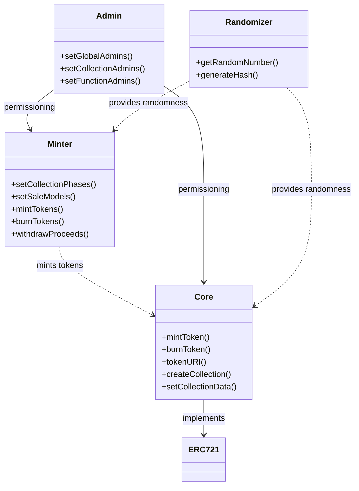

NextGen is a new NFT protocol that is designed to be more flexible and customizable than previous protocols. It offers a number of features that are not available on other platforms, such as the ability to create custom minting models, use on-chain metadata, and integrate with NFTDelegation.com. This makes NextGen a good choice for artists and creators who want to have more control over their NFTs and how they are minted.

One of the key benefits of NextGen is its flexibility. Admins can create collections with a variety of different minting models, including allowlists, phase-based sales, and public sales. They can also set custom royalty splits for each collection and propose separate addresses for primary sales proceeds and secondary royalty proceeds. This gives admins a great deal of control over how their collections are minted and sold.

NextGen is a modular and extensible NFT minting platform that allows creators to launch generative art projects on Ethereum. It consists of the following core contracts:

## Contracts In-Scope

**[smart-contracts/NextGenCore.sol](https://github.com/code-423n4/2023-10-nextgen/blob/main/smart-contracts/NextGenCore.sol)**
**[smart-contracts/MinterContract.sol](https://github.com/code-423n4/2023-10-nextgen/blob/main/smart-contracts/MinterContract.sol)**
**[smart-contracts/NextGenAdmins.sol](https://github.com/code-423n4/2023-10-nextgen/blob/main/smart-contracts/NextGenAdmins.sol)**
**[smart-contracts/RandomizerNXT.sol](https://github.com/code-423n4/2023-10-nextgen/blob/main/smart-contracts/RandomizerNXT.sol)**
**[smart-contracts/RandomizerVRF.sol](https://github.com/code-423n4/2023-10-nextgen/blob/main/smart-contracts/RandomizerVRF.sol)**
[smart-contracts/RandomizerRNG.sol](https://github.com/code-423n4/2023-10-nextgen/blob/main/smart-contracts/RandomizerRNG.sol)
[smart-contracts/XRandoms.sol](https://github.com/code-423n4/2023-10-nextgen/blob/main/smart-contracts/XRandoms.sol)
[smart-contracts/AuctionDemo.sol](https://github.com/code-423n4/2023-10-nextgen/blob/main/smart-contracts/AuctionDemo.sol)

## Core - Implements ERC721 token minting and storage of collection data. Integrates with other contracts.

The Core contract is the main ERC721 implementation that handles token minting and stores collection data on-chain.

It inherits from OpenZeppelin's `ERC721Enumerable` implementation which provides standard ERC721 functionality like `mint`, `burn`, `tokenURI` etc.

Core builds on this base by implementing additional features needed for generative NFT collections.

### Custom Functionality

Some key custom functions Core implements include:

**createCollection** - Stores collection metadata like name, description, artist, generative art details etc on-chain. Auto-assigns a collectionId.

**setCollectionData** - Sets additional collection data like max supply, artist address, max purchases allowed. Reserves tokenId range for the collection.

**updateCollectionInfo** - Allows updating collection details, with restrictions to prevent metadata manipulation.

**changeMetadataView** - Switches metadata source between off-chain and on-chain.

**airDropTokens** - Mints tokens to a list of recipients. Called via Minter. 

**mint** - Mints tokens during allowlist and public phases. Called via Minter.

**burn** - Burns a token, reducing collection supply.

**setTokenHash** - Stores random hash for each token, generated by a Randomizer.

**freezeCollection** - Permanently locks collection data and metadata.

**retrieveCollectionInfo** - Gets on-chain collection details.

**retrieveGenerativeScript** - Returns the generative art script for a tokenId.

### Data Structures

Core stores collection data in structs like:

```solidity
struct collectionInfoStructure {
  string name; 
  string artist;
  string description;
  string website;
  string license;
  string baseURI;
  string library;
  string[] script;
}

struct collectionAdditionalDataStructure {
  address artistAddress;
  uint maxPurchases; 
  uint maxSupply;
  uint reservedMinTokenId;
  uint reservedMaxTokenId;
  address randomizerContract;
}
```

These are stored in mappings, indexed by the `collectionId` assigned on creation.

Token data like ownership and balances are handled by the inherited `ERC721Enumerable` storage.

### Summary

Core provides a customized ERC721 implementation tailored for storing and managing generative art NFT collections, while integrating with other NextGen contracts to enable advanced features.

## Minter - Manages minting logic like allowlists, phases, sales models. Mints ERC721 tokens via Core.

The Minter contract contains all the minting logic and configurations like allowlists, phases, and sales models. It mints ERC721 tokens by integrating with the Core contract.

### Allowlist Minting 

Minter enables allowlist-based minting in phases. In each phase, an allowlist of addresses is allowed to mint up to a max number of tokens based on a Merkle proof.

It also supports minting via delegation to NFTDelegate using `retrieveGlobalStatusOfDelegation`.

Relevant functions:

```js
setCollectionPhases - Configures allowlist and public phases

mint - Checks validity of caller/delegator, allowlist proof, and mints via Core 

airDropTokens - Mints tokens directly to recipients
```

### Sales Models

Minter supports multiple minting sales models that are highly configurable:

- Fixed price
- Descending price curves (exponential or linear) 
- Periodic limited mints 

Models are set via `setCollectionCosts`. The `getPrice` function calculates current cost.

### Phases

Phases allow dividing minting into different periods, each with separate allowlists, prices, limits etc.

Phases are set by calling `setCollectionPhases` and providing start/end times per phase.

### Token Minting

The `mint` and `airDropTokens` functions handle minting by calling the corresponding Core methods like `_mint`, increasing collection supply etc. 

All minting goes through Minter, which acts as the gatekeeper, conducting all validity checks before minting via Core.

### Summary 

Minter encapsulates all complexity around configurable minting logic, allowlists, phases and sales models, enabling a flexible and gas efficient minting process while integrating tightly with Core for token creation.

### Admin - Manages admin roles and permissions.

The Admin contract is responsible for managing admin roles and permissions that can interact with the system's smart contracts.

It allows defining:

- Global admins - Full access 

- Collection admins - Access to one collection

- Function admins - Access to specific functions

### Role Management

The key functions are:

```solidity
// Global admin

registerAdmin - Registers a global admin

// Function admin

registerFunctionAdmin - Grants access to a function

registerBatchFunctionAdmin - Batch grant function access

// Collection admin 

registerCollectionAdmin - Grants access to a collection

// Getters

retrieveGlobalAdmin - Checks if global admin

retrieveFunctionAdmin - Checks function admin status 

retrieveCollectionAdmin - Checks collection admin status
```

These write to mapping structures like:

```solidity
// Global admins
mapping(address => bool) public adminPermissions;  

// Function admins
mapping(address => mapping(bytes4 => bool)) private functionAdmin;

// Collection admins
mapping(address => mapping(uint256 => bool)) private collectionAdmin; 
```

Access is checked by calling the appropriate `retrieve*Admin` function in each contract.

### Owner Admin

The Admin owner can add the first global admins. The owner is set on deployment and cannot be changed.

### Access Control

Only the Admin owner can add global admins.

Global admins can add other function and collection admins.

This creates a hierarchical access control structure.

### Summary

The Admin contract centralizes permission management for NextGen, enabling admin roles to be defined and checked across the system while limiting exposure through its owner-admin hierarchy.

##Randomizer - Generates randomness for generative art. Multiple implementations.

It uses a phased allowlist approach with delegation support via NFTDelegate. The modular architecture allows upgrading contracts individually. Custom sales models, on-chain metadata and provenance features provide flexibility.

Here is a more in-depth look at the Randomizer contracts in NextGen:

### Overview

NextGen uses Randomizer contracts to generate randomness needed for generative art minting. 

Multiple Randomizer implementations are supported using a common interface:

```solidity
interface IRandomizer {

  function calculateTokenHash(uint256 _collectionId, uint256 _tokenId, uint256 _salt) external;

  function isRandomizerContract() external view returns (bool);

}
```

This enables switching randomization sources.

## Implementations

The current Randomizer contracts are:

**VRF** - Uses Chainlink VRF to generate random numbers

**RNG** - Uses ARRNG service to generate random numbers

**NXT** - Custom implementation using on-chain data

### VRF

Integrates with Chainlink VRF through `VRFCoordinatorV2` interface. 

Main steps:

1. Calls `requestRandomWords` on VRFCoordinator during `calculateTokenHash`

2. VRFCoordinator fulfills request and calls `fulfillRandomWords` 

3. `fulfillRandomWords` tells Core to set token hash

### RNG 

Uses ARRNG service. Similar flow:

1. Calls `requestRandomWords` to make request

2. `fulfillRandomWords` triggered by ARRNG response

3. Forwards hash to Core

Funds are required to pay gas for both VRF and RNG.

### NXT 

A simple custom implementation using on-chain data like `blockhash` and `block.timestamp`.

No external requests made. Lower gas cost.

### Tradeoffs

The different Randomizers represent different points on the security-cost-complexity spectrum.

For example, VRF provides cryptographic security guarantees but requires setup and paying for requests. The NXT implementation is fully on-chain but has weaker randomness.

Allowing different implementations provides flexibility to creators.

### Summary

The Randomizer contracts enable NextGen to integrate multiple secure randomness services to meet varying needs across different generative art projects.

## Architecture 

The architecture divides logic into modular contracts by areas of concern:

This promotes separation of duties, minimizing surface area for attacks. For example:

- Core focuses only on ERC721 token functionality
- Minter handles all minting logic and payment flows
- Admin controls permissioning
- Randomizer provides secure randomness

The contracts are designed for interoperability through clearly defined interfaces. This enables them to be updated independently while maintaining system integrity.

**The following deeper dive into the modular architecture.**


- Core implements ERC721 and related token methods
- Minter mints tokens by calling into Core
- Admin sets permissions and access control across Core and Minter
- Randomizer provides randomness services to Core and Minter

The modular structure allows each component to evolve independently while maintaining a clear separation of duties. For example:

- Core just handles token functions, nothing else
- Minter owns all payment flows and minting logic
- Admin centralizes permissioning
- Randomizer encapsulates all randomness 

This enhances security, testability and maintainability of the overall system.

### Separation of Concerns

NextGen divides functionality into separate contracts based on logic domains:

- **Core** - Token minting and metadata storage
- **Minter** - Minting logic like allowlists and sales models
- **Admin** - Permissioning and access control 
- **Randomizer** - Random number generation

This promotes separation of concerns and minimizes the attack surface area of each contract.

For example:

- The Core contract simply focuses on ERC721 token behavior and storage. All minting logic is handled in Minter.

- The Minter owns all payment flows, sale models, allowlist management. Core has no awareness of this complex logic.

- Randomness generation for generative art is entirely encapsulated in the Randomizer contracts. 

- The Admin contract serves the single purpose of permissioning.

### Limited Scope

This separation means each contract only handles a limited set of actions:

- Core has a well-defined scope around tokens.

- Minter solely focuses on minting.

- Randomizer is concerned with randomness.

If a contract is compromised, damage is limited as the contracts don't share logic.

### Interface-based Coupling

Contracts interact via clearly defined interfaces that expose only necessary methods. 

For example, Minter calls into Core only through `IMinterContract`. Randomizers implement `IRandomizer`.

This loose coupling enables independent upgrades.

### Testability 

Narrowly scoped contracts are easier to rigorously test in isolation and make behavior more predictable.

### Tradeoffs

There is additional complexity around managing contract interactions. Events and return values become more critical.

However, the overall benefits around security, maintenance, and flexibility outweigh these tradeoffs.

### Conclusion

NextGen's architecture minimizes risks by separating functionality across contracts based on logic domains and using interface-based contract interactions. This is a well-regarded best practice for building secure and extensible blockchain systems.

## Code Quality

The codebase follows best practices like:

- Use of dependency contracts via interfaces not implementations 

- Consistent validation of inputs and return values

- Fail early and fail loud principles

- Use of modifiers over conditionals for access control

- Events for important state changes

- Separation of concerns between contracts

- Detailed natspec comments

- Use of libraries like OpenZeppelin for secure implementations

This indicates an intention to create high quality, resilient and upgradable contracts.

## Potential Issues

### Centralization Risks

The Admin contract owner has significant power. They can:

- Add other global admins
- Update admin contract address
- Withdraw funds via `emergencyWithdraw`

An admin takeover could have major impacts. Suggested mitigations:  

- Timelock for critical admin functions
- Multi-sig schemes

**Admin Owner Powers**

The Admin contract owner is set on deployment and cannot be changed. This address has tremendous powers:

- Adding global admins who gain full access

- Changing the Admin contract's own address

- Withdrawing funds deposited in contracts via `emergencyWithdraw`

### Impacts of Compromise

If the owner address is compromised, the attacker gains the ability to:

- Add themselves or others as global admins

- Update the Admin contract address to a malicious version 

- Drain funds from the system by withdrawing to their own address

They can then do virtually anything - change sale prices, transfer tokens, update metadata etc.

### Mitigating Centralized Power 

The following techniques could help:

**Timelocks** - Applying timelocks to the critical admin functions like changing admin address and `emergencyWithdraw` would rate limit malicious actions.

**Multisig** - Requiring multiple signatures from a multisig wallet to call admin functions creates additional oversight. 

**Limit Admin Power** - Removing certain high risk functions from the Admin's capabilities like `emergencyWithdraw`.

**Admin Hierarchy** - Adding more admin tiers with strictly limited permissions reduces reliance on the top tier.

**Ownership Renunciation** - The owner could renounce ownership after setup. But this permanently locks the system.

## Conclusion

The Admin owner's centralized authority poses a definite risk. Techniques like timelocks, multisig schemes and hierarchical admin roles could help mitigate this concern through added oversight and limiting the blast radius from any compromise.

## Allowance Tracking

Allowlist minting allowances are tracked on-chain per phase. But issues could occur with:
  
- Restarting phases
- Changing phase order 
- Unminted carry overs in periodic sales
   
This could complicate allowance accounting. Tightening validity checks could help.

**The Minter contract tracks allowlist minting allowances on-chain using mappings like:**

```solidity
// Allowances per phase per address
mapping(uint256 => mapping(address => uint256)) public allowlistAllowances; 

// Total minted per phase per address  
mapping(uint256 => mapping(address => uint256)) public mints;
```

Before minting, it checks:

```js
require(allowlistAllowances[phase][msg.sender] >= mints[phase][msg.sender] + numToMint)
```

## Risk Scenarios

As I pointed out, some dangerous scenarios around the allowance accounting are:

**Restarting Phases** - If a past phase is restarted, already expended allowances could be reset and reuse the quotas.

**Phase Order Changes** - Changing the order of phases can make allowance tracking ambiguous.

**Periodic Sales Carry Over** - Unused periodic sale allowances carrying over indefinitely can allow hoarding tokens.

## Mitigations

To harden allowance accounting, some mitigations include:

- Prevent restarting phases or mutate phase order - this can be validated against the initial set phases.

- Expire periodic sale allowances after fixed intervals if unused - this prevents hoarding.

- Aggressive input validation on amounts to mint - check for overflows, unexpected values.

- Separate storage of total used vs allocated allowances - comparing the two can reveal discrepancies. 

- Allowlist expiration - prevent minting against very old allowlists.

## Conclusion

Adding validity checks on phase changes, capping carry overs, comparing independent counters, and aggressive input validation could help minimize issues. The area definitely merits close scrutiny during auditing.

## Batch Operations

Functions like `updateImagesAndAttributes` allow batch edits. Bugs impacting one token could affect many. Recommend bounding batch sizes. 

The `updateImagesAndAttributes` function allows updating token URIs and metadata attributes in a batch by passing arrays:

```solidity
function updateImagesAndAttributes(
  uint256[] memory _tokenIds,
  string[] memory _imageURIs,
  string[] memory _attributes
) external; 
```

This is convenient but dangerous - any bug or exploit could impact a large number of tokens in one call.

For example, an off-by-one error could erase or corrupt metadata for the entire array.

## Potential Mitigations

To limit potential damage from batch operations, some good mitigations are:

**Bound Batch Sizes** - Placing a reasonable limit on the maximum batch size allowed in one call prevents unbounded operations.

**Input Validation** - Rigorously validate the length of all passed arrays - ensure they match and are <= max batch size.

**Rate Limiting** - Limiting how often batch functions can be called reduces risk.

**Authorization** - Requiring a high privilege admin role to call batch functions adds oversight.

**Events** - Emitting events for each token updated improves auditability. 

**No Nested Batches** - Disallow calling batch functions from within batch functions.

## Conclusion  

So, batch operations require heightened caution as a single bug can have amplified consequences. Adding limits, validation, rate limiting and access controls to NextGen's batch functions could effectively mitigate the increased risk surface.

## Cross-contract Interface Attack Surface 

Contracts use interface-based dependencies to enable upgrading. But new implementations must maintain the original interfaces to not break integrations. Malicious implementations could exploit this.

**Interface-based Contract Coupling** 

NextGen uses interface-based dependencies between contracts - e.g. Core calls into Minter via the `IMinter` interface. This provides flexibility to upgrade contract implementations.

However, it also introduces risks:

- New implementations must adhere to original interfaces
- Malicious implementations could exploit expectations around interfaces

## Attack Scenarios

Some potential attacks via malicious implementations are:

- **Minter** - Could mint tokens without recording payments
- **Randomizer** - Could selectively omit randomness for certain tokens  
- **Admin** - Could silently add malicious admins

## Potential Mitigations

Some ways to mitigate these risks include:

- Strictly validate return values from interface calls
- Bind interface implementations to a specific version identifier
-Emit events for critical interface interactions 
- Assign interface roles to addresses via privileged methods only
- Perform integrity checks on data passed via interfaces 

## Conclusion

NextGen's interface-based architecture expands the attack surface. Extra validations, binding versions explicitly and added auditing around interfaces could help minimize this risk.

## Overall Conclusion

Overall NextGen demonstrates well-designed modular architecture, separation of concerns between contracts and use of secure coding practices. Some centralization risks exist with admin powers. Allowance tracking could be improved and buffers added for batch operations. The interface-based contract dependencies also create risks that should be monitored closely. But generally the system appears well-architected to meet its goals of an extensible and customizable NFT minting platform.

### Time spent:
15 hours