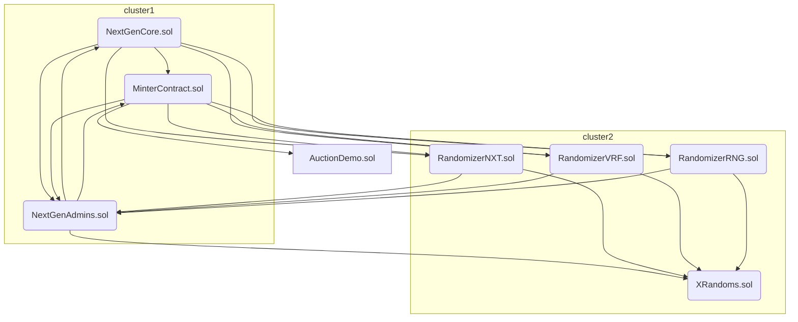
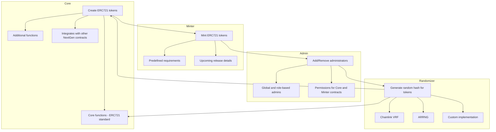

  <h1> NextGen: Smart Contracts Analysis</h1>
  <h5>Advanced smart contracts for launching generative art projects on Ethereum.</h5>

## Index
- [Index](#index)
- [1. NextGen Project: A Comprehensive Overview](#1-nextgen-project-a-comprehensive-overview)
- [2. All the contracts and the analyses of them](#2-all-the-contracts-and-the-analyses-of-them)
  - [1. NextGenCore.sol Contract :](#1-nextgencoresol-contract-)
  - [2. MinterContract.sol Contract:](#2-mintercontractsol-contract)
  - [3. NextGenAdmins.sol Contract:](#3-nextgenadminssol-contract)
  - [4. RandomizerNXT.sol Contract:](#4-randomizernxtsol-contract)
  - [5. RandomizerVRF.sol Contract:](#5-randomizervrfsol-contract)
  - [6. RandomizerRNG.sol Contract:](#6-randomizerrngsol-contract)
  - [7. XRandoms.sol Contract :](#7-xrandomssol-contract-)
  - [8. AuctionDemo.sol Contract:](#8-auctiondemosol-contract)
  - [Privileged Roles:](#privileged-roles)
  - [How the contract interacts with each other](#how-the-contract-interacts-with-each-other)
- [3. Approach taken in evaluating the codebase](#3-approach-taken-in-evaluating-the-codebase)
- [4. NextGen Architecture](#4-nextgen-architecture)
- [5. Systemic and Centralization Risks](#5-systemic-and-centralization-risks)
  - [In the NextGenAdmins.sol contract:](#in-the-nextgenadminssol-contract)
  - [In the RandomizerNXT.sol contract:](#in-the-randomizernxtsol-contract)
  - [In the RandomizerRNG.sol contract:](#in-the-randomizerrngsol-contract)
  - [In the XRandoms.sol contract:](#in-the-xrandomssol-contract)
  - [In the AuctionDemo.sol contract:](#in-the-auctiondemosol-contract)
- [6. New insights and learning from this audit](#6-new-insights-and-learning-from-this-audit)
- [7. Security Approach of the Project](#7-security-approach-of-the-project)
- [8. Test analysis](#8-test-analysis)
- [9. Conclusion](#9-conclusion)

## 1. NextGen Project: A Comprehensive Overview
> Advanced smart contracts for launching generative art projects on Ethereum.

NextGen focuses on generative art and other use cases of on-chain NFTs. It combines features of on-chain generative contracts with a phase-based, whitelist-based, and delegation-based minting philosophy. It also allows for passing arbitrary data to the contract to customize the outputs and supports multiple NFT creation models assigned to different phases.

## 2. All the contracts and the analyses of them
### 1. NextGenCore.sol Contract :
**Purpose:**
The purpose of this smart contract is to serve as the main infrastructure for the creation, management, and minting of non-fungible tokens on a next-generation platform. It is designed to enable the creation of NFT collections, define specific attributes and features for each collection, and facilitate the minting and distribution of these NFTs to owners and collectors. The contract also focuses on governance and access management, ensuring that only authorized actors can perform critical actions on the platform.

**Key Functionality:**
  1. **Collection Creation:** The contract allows users to create new NFT collections by providing detailed information about each collection, such as name, artist, description, website, and license. It is also possible to define a base URI for the collection's NFTs and provide scripts for generating specific metadata.

  2. **NFT Minting:** Authorized users can create new NFTs within a collection using the minting function. This can be done in both the allowlist phase and the public sale phase. The contract records minted NFTs by address and collection.

  3. **Airdrops:** In addition to traditional minting, the contract allows airdrops of NFTs to specific addresses. This can be useful for promotions and special events.

  4. **Governance Functions:** The contract integrates governance functions, which means that only designated administrators can perform certain critical actions, such as creating collections, artist signatures, and data updates. This provides a level of control and security on the platform.

  5. **Burn:** NFT owners can burn their tokens, reducing the circulating supply. This is used to remove NFTs from the platform.

  6. **On-Chain Metadata:** The contract supports on-chain metadata management for NFTs, meaning that some data related to NFTs is stored directly in the contract, allowing for on-chain customization and display.

  7. **Randomizer Integration:** It allows the integration of an external contract called "Randomizer" to generate hashes and other random elements related to the NFTs.

**Utility:**
The utility of this smart contract lies in its ability to facilitate the creation and management of NFTs on a next-generation platform. It provides artists and content creators with a way to digitize their work and bring it into circulation. Collectors can acquire and trade these NFTs, offering new opportunities in the digital collectibles space. Additionally, governance and management functions ensure that the platform operates securely and in a controlled manner.

> The `NextGenCore.sol` contract is a fundamental part of an NFT platform that allows users to efficiently and securely create, manage, and distribute NFT collections, as well as provides support for metadata customization and governance.

### 2. MinterContract.sol Contract:
**Purpose:**
The contract aims to facilitate various functions related to the administration and operation of non-fungible token collections on a specific platform. These functions include the creation, exchange, revenue sharing, and the update of core and admin contracts.

**Key Functionality:**
  1. **`burnOrSwapExternalToMint`:** Allows users to burn or swap NFTs from an external collection for tokens of a specific collection. It verifies authorization, NFT ownership, and time-based conditions.

  2. **`setPrimaryAndSecondarySplits`:** Allows setting primary and secondary revenue split percentages for a specific collection.

  3. **`proposePrimaryAddressesAndPercentages`:** Users can propose addresses and percentages for primary revenue sharing.

  4. **`proposeSecondaryAddressesAndPercentages`:** Similar to the previous function, but used for secondary revenue sharing.

  5. **`acceptAddressesAndPercentages`:** Enables the acceptance or rejection of proposed addresses and percentages for revenue sharing.

  6. **`payArtist`:** Facilitates the payment of revenue to artists and teams associated with a collection. It calculates revenue sharing and performs transfers.

  7. **`updateCoreContract`:** Used to update the core contract related to the platform.

  8. **`updateAdminContract`:** Allows updating the admin contract related to the platform.

  9. **`emergencyWithdraw`:** In emergency situations, funds can be withdrawn from the contract.

**Utility:**
   - The contract allows users to exchange NFTs from an external collection for tokens of a specific collection on the platform.
   - It facilitates the establishment of revenue sharing percentages between artists and teams.
   - Users can propose and accept addresses and percentages for revenue sharing.
   - It calculates revenue sharing and facilitates payments to associated artists and teams.
   - Provides functions for updating core and admin contracts.
   - Offers an emergency withdrawal function for the contract's balance.

### 3. NextGenAdmins.sol Contract:
**Purpose**:
The ``NextGenAdmins.sol`` contract is designed to manage and grant administrative permissions within the NextGen contract ecosystem. It allows for the designation of global and local administrators to control specific functions and collections. 
> Its purpose is to establish an authorization and access control system to ensure secure and efficient operation of NextGen-related contracts.

**Key Functionality**:
  1. **Registration of Global Administrators**: The contract allows owners to designate global administrators by granting them permissions to perform administrative actions across the entire contract system.

  2. **Registration of Function Administrators**: Administrators can grant permissions to specific addresses to execute specific functions in contracts, based on the function's selector (bytes4). This enables granular control over who can perform certain operations.

  3. **Registration of Collection Administrators**: Administrators can designate permissions for specific addresses over particular collections. This is essential for managing access and control over certain asset collections within the ecosystem.

  4. **Permission Verification**: The contract provides functions to verify whether an address has global administrator permissions, specific function permissions, or permissions over a particular collection.

**Utility**:
The main utility of the ``NextGenAdmins contract`` lies in establishing an access control and authorization system within the NextGen environment. It enables efficient management of administrators who can make decisions and execute actions in NextGen-related contracts. This ensures that only authorized parties have the ability to perform critical operations and control specific functions and collections of digital assets. Additionally, it enhances security and governance within the ecosystem by clearly defining who has control and access to various components of the contract system.

### 4. RandomizerNXT.sol Contract:
**Purpose**:
	The RandomizerNXT contract is responsible for generating a random hash for each token during the minting process using the NextGen's proposed approach.

**Key Functionality**:
  1. **Initialization and Contract References**: The contract is initialized with references to the "IXRandoms" contract for random data, the "INextGenAdmins" contract for administrative control, and the "INextGenCore" contract for token management. These references enable the contract to interact with these components.

  2. **Function Admin Control**: The contract includes a modifier "FunctionAdminRequired" to control access to certain functions. Only global or function administrators can invoke these functions, ensuring controlled access to critical functionality.

  3. **Contract Updates**: The contract allows for the update of references to external contracts. This ensures adaptability and flexibility in case the contract's dependencies change or need to be upgraded.

  4. **Calculation of Random Hash**: The core functionality of the contract is the calculation of a random hash. This is achieved by combining various inputs, including the mint index, the previous block's hash, and random data obtained from the "IXRandoms" contract. The resulting hash is then associated with the corresponding token within the "INextGenCore" contract.

  5. **Contract Status Check**: The contract provides a function to check whether it is functioning as a randomizer contract, which can be useful for verification and integration with other components.

**Utility**:
The utility of the ``RandomizerNXT.sol`` contract lies in its ability to generate unique and random hash values for tokens during the minting process. By providing controlled and authorized access to key functions and allowing updates to external contract references, this contract offers flexibility and adaptability to meet changing requirements.

> 👀 RandomizerNXT contract plays a crucial role in ensuring the uniqueness and unpredictability of token attributes in NFTs. It offers a valuable tool for applications requiring randomness and distinctiveness in their token generation process.

### 5. RandomizerVRF.sol Contract:
**Purpose**:
The ``RandomizerVRF.sol`` contract is designed to generate a random hash for each token during the minting process using [Chainlink's VRF](https://docs.chain.link/vrf) service. 

**Key Functionality**:
  1. **Requesting Random Words**: The contract allows the "gencore" contract to request random words by calling the "requestRandomWords" function. This request utilizes Chainlink's VRF service to obtain random results. Each request generates a unique identifier associated with a specific token.

  2. **Fulfilling Random Words**: When the Chainlink VRF service returns random words as a result, the "RandomizerVRF" contract records that result in the "gencore" contract using the "fulfillRandomWords" function. This ensures that the hash value is correctly assigned to the corresponding token.

  3. **Service Parameter Updates**: The contract allows the update of key parameters related to the Chainlink VRF service, such as the gas limit for result delivery and the key hash used. This enables the adaptation of the contract to changing needs.

  4. **Request Data Updates**: The contract supports updates to data related to requests, including the subscription ID, the number of words requested, and the required confirmations. This provides flexibility in configuring the random generation process.

### 6. RandomizerRNG.sol Contract:
**Purpose**:
  The ``RandomizerRNG.sol`` contract is designed to generate a random hash for each token during the minting process using the [ARRng.io](https://www.arrng.io/) service.

**Key Functionality**:
  1. **Requesting Random Words**: The contract allows the "gencore" contract to request random words by calling the "requestRandomWords" function. The request includes an amount of Ether as a reward for the ARRng.io service. This request generates a unique request identifier associated with a specific token.

  2. **Fulfilling Random Words**: When ARRng.io returns random words as a result, the "RandomizerRNG" contract records that result in the "gencore" contract using the "fulfillRandomWords" function. This ensures that the hash value is correctly assigned to the corresponding token.

  3. **Contract and Cost Updates**: The contract supports the update of related contracts and costs through specific functions. This allows flexibility in the management and configuration of the contract.

  4. **Emergency Fund Withdrawal**: The contract includes a function that allows the withdrawal of accumulated funds in the contract. This function is used to securely withdraw funds when necessary.

> Additionally, the contract supports updates to related contracts and costs, allowing administrators to configure and adapt the system to changing needs. It also includes an emergency fund withdrawal function to ensure the security of funds stored in the contract.

### 7. XRandoms.sol Contract :
  **Purpose**:
  The purpose of the ``XRandoms.sol`` contract, also known as "randomPool," is to provide a source of randomness and to generate random words from a predefined list. 

  **Key Functionality**:
  1. **Random Word Generation**: The contract allows users to generate random words by calling the "randomWord" function. It utilizes a random number obtained from the block's hash and timestamp to select a word from a list of 100 predefined words.

  2. **Random Number Generation**: The contract also provides the ability to generate random numbers between 0 and 999 by calling the "randomNumber" function. It uses a similar randomization mechanism based on block information.

  3. **Specific Word Retrieval**: Users can retrieve a specific word from the predefined list by providing an index to the "returnIndex" function. This allows for the selection of a particular word from the list.

  **Utility**:
  The utility of this contract lies in its ability to provide randomness and generate random words for various applications. Some potential use cases and utility include:

  - **Random Selection**: Applications or games can use the "randomWord" or "randomNumber" functions to select random elements or determine outcomes, adding an element of unpredictability.

  - **Word Generation**: It can be used for creative or educational purposes to generate random words, which can be used in writing, storytelling, or language-related activities.

  - **Fairness**: The random number generation capability can be used in situations where fairness and impartiality are required, such as selecting a winner from a pool of participants.

  - **Entertainment**: The contract can be used for entertainment purposes, such as generating random words for fun or trivia games.

### 8. AuctionDemo.sol Contract:
  **Purpose**:
  The purpose of this ``AuctionDemo`` contract is to facilitate auctions on a platform. Users can participate in auctions to acquire assets represented by non-fungible tokens owned by an NFT contract called ``gencore`` This contract is used to manage auctions, bids, and the allocation of NFTs to winning bidders.

  **Key Functionality**:
  1. **Participate in the Auction**: Users can participate in the auction by sending Ether as a bid to the smart contract. To do so, they need to call the "participateToAuction" function, providing the NFT token ID being auctioned and an amount of Ether as a bid.

  2. **Determine the Highest Bid**: The contract keeps track of bids and maintains a record of the highest bids for each NFT in the auction.

  3. **Claim the Won NFT**: After the auction ends, the user with the highest bid can claim the won NFT by calling the "claimAuction" function. The NFT is transferred to the winning bidder, and their previous bid is refunded.

  4. **Cancel Bids**: Users have the option to cancel their bids by calling the "cancelBid" or "cancelAllBids" functions. This allows them to withdraw their bids if they change their minds before the auction concludes.

  5. **Bid Record**: The contract maintains a record of all bids made in a data structure called "auctionInfoData," which stores information about bidders, bid amounts, and bid statuses.

  **Utility**:
  The utility of this contract lies in facilitating decentralized NFT auctions. It provides a secure and transparent means for users to participate in auctions, place bids, and claim NFTs if they are the winning bidders. Additionally, it allows users to cancel their bids if they wish to do so before the auction ends.

>  It's important to note that this contract interacts with other contracts such as "IMinterContract," "IERC721," and "INextGenAdmins," which are likely part of the broader platform infrastructure. The purpose and functionality of these contracts will depend on their respective source code and roles in the system.
  
### Privileged Roles:
The **NextGen project** defines some **privilege** **roles** that control who can perform specific actions within the contract:

1. **adminsContract**: The Admin contract is responsible for adding or removing global or function-based admins who are allowed to call certain functions in both the Core and Minter contracts, for example:
   - Admins can register additional global admins, collection admins and function admins on the Admin Contract.
   - Admins, depending on their access levels, can interact with specific functions on the Core, Minter and Admin contract.
   - While the Core contract is all on-chain and never changes, admins can update the smart contract addresses of the Minter, Admin and Randomizer contracts to provide new features.
> Note:  All contracts will be managed by NextGen Core team via a safe gnosis wallet.

### How the contract interacts with each other

## 3. Approach taken in evaluating the codebase
- **High-level overview:** I analyzed the overall codebase in one iteration to get a high-level understanding of the code structure and functionality.

- **Documentation review:** I studied the documentation to understand the purpose of each contract, its functionality, and how it is connected with other contracts.

- **Literature review:** I read old audits and known findings, as well as the bot races findings.

- **Testing setup:** I set up my testing environment and ran the tests to ensure that all tests passed. Used npm and hardhat to test this protocol.

- **Detailed analysis:** I started with the detailed analysis of the code base, line by line. I took the necessary notes to ask some questions to the sponsors.

## 4. NextGen Architecture
The architecture of NextGen's smart contracts consists of four main contracts:

1. **Core**: This contract is responsible for creating ERC721 tokens and includes the core functions of the ERC721 standard, as well as additional functions for configuring and retrieving information about a collection. It also integrates with other NextGen contracts to provide flexible functionality.

2. **Minter**: The Minter contract is used to mint ERC721 tokens for a specific collection in the Core contract, following predefined requirements. It contains details about upcoming releases, such as dates, sales models, artist addresses, and more.

3. **Admin**: The Admin contract allows adding or removing global or role-based administrators who have permissions to call specific functions in the Core and Minter contracts.

4. **Randomizer**: This contract generates a random hash for each token during the minting process. NextGen offers three different options for generating these hashes: using Chainlink VRF, ARRNG, or a custom implementation.

> Important Reminder: Collectively, these contracts manage the creation and administration of ERC721 tokens in the NextGen ecosystem.

## 5. Systemic and Centralization Risks
> 🚨 Analyze these contracts and these can be the systemic and centralization risks that we consider the most

### In the NextGenAdmins.sol contract:
**Systemic Risks**:
   1. **Dependency on Contract Security**: The ``NextGenAdmins`` contract plays a crucial role in access control and authorization within the NextGen contract ecosystem. There is a systemic risk in relying on the security and proper functioning of this contract. Any vulnerability or exploitation in "NextGenAdmins" could compromise the integrity and security of the entire NextGen contract system.

   2. **Errors in Permission Management**: Errors in the assignment of administrator permissions, whether at the global, function, or collection level, can have a systemic impact on the operation of NextGen contracts. Incorrect permission settings could allow unauthorized actions or restrict access to critical functions.

**Centralization Risks**:
   1. **Centralized Global Administrators**: If a limited number of global administrators have excessive control or if their actions are not adequately supervised, there is a centralization risk in authority and access to critical functions within the system. This could lead to unilateral decisions or abuses of power.

   2. **Risk of Owner Change**: The contract begins with the original owner assigning permissions, posing a risk of owner change. If original owners change, they may significantly modify permissions, affecting the operation and governance of the system.

   3. **Dependency on Owner's Identity**: The identity and intentions of the original owner are critical for permission management and decision-making. Centralization of this identity could be a risk if the reliability and transparency of the owner are compromised.

### In the RandomizerNXT.sol contract: 
**Systemic Risks**:
   1. **Dependency on External Contracts**: The ``RandomizerNXT`` contract relies on external contracts such as "IXRandoms" and "INextGenCore" to obtain random data and manage tokens. The systemic risk lies in the dependence on the integrity and functioning of these external contracts. If any of the external contracts experience a failure or are compromised, it could affect the operation of the ``RandomizerNXT`` contract and the generation of random hashes.

   2. **Updates to External Contracts**: Updates or changes to external contracts can have an impact on the RandomizerNXT contract. Unforeseen updates in external contracts could trigger conflicts and affect the generation of random hashes.

**Centralization Risks**:
   1. **Administrator Control**: The ``RandomizerNXT`` contract grants access and control to administrators who can update external contracts and perform calculations for random hashes. If a limited number of administrators have excessive control or if their actions are not adequately monitored, there is a risk of centralized control that could lead to misuse or unilateral decisions affecting the system's integrity.

### In the RandomizerRNG.sol contract:
**Systemic Risks**:
   1. **Dependency on the ARRng.io Service**: The contract relies on the [ARRng.io](https://www.arrng.io/) service for the generation of random words and, consequently, random hash values. Any failure or interruption in the ARRng.io service could affect the contract's ability to generate random hash values, potentially negatively impacting applications using this contract.

   2. **Pseudorandomness**: The generation of random hash values is based on block operations, such as keccak256 and timestamp. This is considered pseudorandom, as it may not be entirely unpredictable and could be subject to attacks or manipulations if block data is known.

**Centralization Risks**:
   1. **Centralized Control of the ARRng.io Service**: The contract uses the ARRng.io service for generating random words. The availability and operation of this service are beyond the control of the contract and can be considered centralized. Changes or issues with the ARRng.io service can affect the generation of random hash values.

> To mitigate these risks, it is essential to understand the limitations of random hash value generation based on external services and consider additional solutions to ensure the resilience and security of the randomness generation process. It is also crucial to minimize the contract's dependency on centralized services and have a contingency strategy in case of disruptions in the ARRng.io service.

### In the XRandoms.sol contract:
**Systemic Risks**:
   1. **Pseudorandom Number Generation**: The contract generates random numbers based on operations like keccak256 of blockchain data, such as block number and timestamp. This is considered pseudorandom, as it may not be entirely unpredictable and could be subject to attacks or manipulations if these data are known. The security of the random numbers largely depends on the security of the underlying blockchain.

   2. **Potential Predictability**: Random number generation based on block data could be predictable if an attacker has access to information about the blockchain state at the time of the contract call. This could expose it to guesswork attacks.

**Centralization Risks**:
   1. **Centralized Control of the Word List**: The contract maintains a list of predefined words. Updating or modifying this list would require centralized intervention and is not user-controllable. This introduces an element of centralization in the selection of words available for generation.
   The list of predefined words is static and does not allow users to contribute new words or modify the list. This may limit the diversity and customization of the generated words.

> To mitigate these risks, it's essential to understand the limitations of blockchain-based random number generation and consider additional solutions, such as using trusted external oracles or contracts specializing in more secure random number generation. Additionally, consider allowing users to contribute new words or modify the word list to increase system flexibility and decentralization.

### In the AuctionDemo.sol contract:
**Systemic Risks**:
1. **Dependency on Other Contracts**: The contract relies on interactions with other contracts like "IMinterContract," "IERC721," and "INextGenAdmins." Any changes or vulnerabilities in these contracts can affect the functionality and security of "AuctionDemo."

**Centralization Risks**:
1. **Centralized Administration**: The contract depends on the "INextGenAdmins" interface to allow certain actions, such as claiming a won NFT. Centralized administration through this interface could lead to a lack of decentralization and unilateral decision-making.

## 6. New insights and learning from this audit
We've gained a comprehensive understanding of the project's multifaceted architecture and the pivotal role played by its smart contracts. After a week of full review these insights include:
   1. **Project Focus:** NextGen's primary focus is on generative art and on-chain NFT use cases, reflecting a commitment to innovative and artistic applications within the blockchain space.

   2. **Complex Minting Philosophy:** NextGen employs a sophisticated minting philosophy that encompasses on-chain generative contracts, phase-based minting, whitelist-based access, and delegation-based mechanisms. These multiple minting methods provide flexibility but require users to grasp the nuances of each approach.

   3. **Comprehensive Core Contract:** The NextGenCore.sol contract serves as the project's foundational infrastructure. It enables users to create, manage, and mint NFT collections with detailed attributes and metadata. Governance and access management features enhance security, but they necessitate effective administrative control.

   4. **Utility and Flexibility:** The contract's utility extends to artists and creators, providing a digitization platform for their work. Collectors benefit from an ecosystem that enables the acquisition and trade of unique NFTs. The contract's governance functions offer adaptability and control.

   5. **Randomization Integration:** Integration with an external "Randomizer" contract allows for the generation of random elements related to NFTs, ensuring the uniqueness and unpredictability of token attributes.

   6. **Administrative Contracts:** Contracts like MinterContract and NextGenAdmins enable various administrative functions, such as revenue sharing, updating core and admin contracts, and defining administrator roles. These functionalities are crucial for the dynamic management of the platform.

   7. **External Services for Randomization:** The presence of multiple Randomizer contracts (VRF, RNG) demonstrates the project's commitment to offering flexibility in choosing randomization methods. It ensures that the platform can adapt to changing requirements and preferences.

   8. **XRandoms Utility:** The XRandoms contract serves as a valuable source of randomness, enabling the generation of random words and numbers. It can find applications in scenarios requiring randomness, creative content generation, fairness, and entertainment.

   9. **AuctionDemo for NFT Auctions:** The AuctionDemo contract facilitates decentralized NFT auctions, offering transparent and secure participation, bid management, and NFT allocation. Users can actively participate, manage their bids, and claim NFTs with the highest bid.

   10. **Privileged Roles:** The presence of privileged roles, such as global administrators, highlights the importance of access control and governance within the ecosystem. Effective management of these roles is essential for the smooth operation of the platform.

These insights underscore the depth and complexity of the NextGen project, demonstrating a commitment to creating a versatile and adaptable ecosystem for NFT creation and management while also emphasizing the importance of user understanding, effective governance, and security.

## 7. Security Approach of the Project
What the project can add in the understanding of security:
  - After the Code4rena audit is completed and the project is live, I recommend the audit process to continue, projects like [immunefi](https://immunefi.com/).

## 8. Test analysis
The audit scope of the contracts to be reviewed is 100% but we recommended to make invariants tests in the future to increase the safety of the project. 

## 9. Conclusion 
**NextGen project** exhibits an interesting and well-developed architecture we believe the team has done a good job regarding the code, but the identified risks need to be addressed, and measures should be implemented to protect the protocol from potential malicious use cases. It is also highly recommended that the team continues to invest in security measures such as mitigation reviews, audits, and bug bounty programs to maintain the security and reliability of the project.

### Time spent:
60 hours