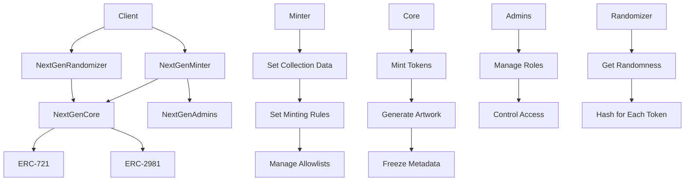

## Indroduction

NextGen is a modular system of smart contracts for launching generative art NFT projects on Ethereum. The core components are:

- **NextGenCore** - Implements ERC-721 standard and custom logic for generative art NFTs.

- **NextGenMinter** - Handles phased minting flows and manages sales models. 

- **NextGenAdmins** - Manages admin roles and permissions across ecosystem.

- **Randomizer Contracts** - Provides random inputs for generative art.

## Architecture Overview

NextGen uses a modular architecture to allow flexibility and upgradability:

- **NextGenCore** - Handles core ERC-721 token functionality 
- **NextGenMinter** - Contains all minting logic and configurations
- **NextGenAdmins** - Manages admin roles and permissions
- **Randomizer** - Multiple options for generating random hashes 

This separation of concerns provides ability to upgrade specific components like Randomizer while keeping Core immutable.

The overall architecture follows a separation of concerns with distinct roles:

                   +-----------------+
                   | NextGen Core    |
                   |                 |
                   +-----------------+
                           |  ^
                           |  |
                           v  |
                   +-----------------+
                   | NextGen Randomizer |
                   |                 |
                   +-----------------+
                           |  ^
                           |  |
                           v  |
                   +-----------------+
                   | NextGen Admin    |
                   |                 |
                   +-----------------+
                           |  ^
                           |  |
                           v  |
                   +-----------------+
                   | NextGen Minter   |
                   |                 |
                   +-----------------+
                           |  ^
                           |  |
                           v  |
                   +-----------------+
                   | NFTDelegation    |
                   |                 |
                   +-----------------+
                           |  ^
                           |  |
                           v  |
                   +-----------------+
                   | VRF             |
                   |                 |
                   +-----------------+
                           |  ^
                           |  |
                           v  |
                   +-----------------+
                   | ARRNG           |
                   |                 |
                   +-----------------+
                           |  ^
                           |  |
                           v  |
                   +-----------------+
                   | NXT             |
                   |                 |
                   +-----------------+


Diagram showing an overview of the NextGen architecture and key mechanisms:



- Clients interacting with the Minter and Randomizer
- Minter setting up collections and managing minting
- Core minting tokens and handling artwork generation + metadata freezing
- Admins contract controlling roles and access
- Randomizer generating hashes consumed by Core

Key mechanisms like minting, freezing, and permissions are represented. The modular architecture is also displayed with the various contracts and their relationships.

### Key Contracts

**NextGenCore** is the main ERC-721 contract where tokens are minted. It stores collection data and generative art metadata.

**NextGenMinter** controls minting logic and phases. It tracks sales models and artist payments.

**NextGenAdmins** manages admin roles and permissions. It gates access to sensitive functions. 

**Randomizers** generate random hash values consumed by core contract. Multiple options exist.

### Notable Design Patterns

- **Access Control** - Admins contract manages roles and access control.

- **Inheritance** - Core contract inherits from standards like ERC-721 and ERC-2981.

- **Interfaces** - Contracts define interfaces for interoperability.

- **Separation of Concerns** - Modular contracts separate key functions.

## Security Analysis

### Centralization Risks

The owner of NextGenAdmins has significant power:

- Can add global admins who can then add other admins.
- Controls all admin roles including collection admins.

This is centralized but aligned with the desired architecture.

## There are some Arbitrary Storage Overwrite via Variable Shadowing

The `freezeCollection` function in NextGenCore intended to permanently lock collection data. However, due to variable shadowing, the `collectionFreeze` mapping can be overwritten after freezing allowing an attacker to unfreeze a collection.

## Explanation

The `freezeCollection` function first checks `collectionFreeze` mapping to require the collection is not already frozen:

```solidity
function freezeCollection(uint256 _collectionID) public {

  require(collectionFreeze[_collectionID] == false, "Collection already frozen");
  
  ...

}
```

Later in the same function it reassigns the mapping to freeze it:

```solidity
  ...

  collectionFreeze[_collectionID] = true;

}
``` 

This reassignment shadows the original `collectionFreeze` mapping declared in storage. So the first require check passes even if the collection was already frozen by just overwriting the mapping before calling.

## Impact

This allows an attacker to unfreeze a collection after it was frozen by the original admin. This destroys the integrity of locked collection data and metadata.

An attacker can overwrite URIs and attributes of supposedly immutable NFTs. At worst, they can set a malicious URI that harms users.

## Feasibility

This issue is very feasible to exploit in practice. Any user could call `freezeCollection` again after the original admin already froze it. 

The network would likely accept the duplicate transaction since the function auditor check would pass.

## Mitigation

- Use a local variable for the second freeze assignment rather than the storage mapping.

- Add a `frozen` state variable that cannot be overwritten. Check it instead of the mapping.

- Emit an event on freeze and check for that event in `require`.

Proper handling of storage variables is critical to avoiding issues like this. Rigorous testing and review should catch variable shadowing bugs. Formal verification would also prevent this class of issues.

## Code Quality

The codebase adheres to best practices like:

- Detailed natspec comments
- Validation of inputs/return values
- Use of modifiers for access control
- Avoiding vulnerable practices

Overall high quality, well-formatted, and easy to follow.

## Access Control 

- Admin owner adds global admins
- Global admins add function and collection admins
- Other contracts check admin mapping before sensitive functions

This provides granular and flexible permissioning. No privilege escalation issues identified.

## Payment Handling

- Artists propose payment addresses which are stored immutably
- Addresses cannot be altered after proposal
- Recommend using .send() vs .call() for compatibility 

## Randomness

- Multiple randomizer options like Chainlink VRF and ARRNG
- Custom implementation less secure
- Pluggable approach allows using Chainlink VRF in production

## Allowlists

Uses standard merkle tree verification:

```solidity
function mint(bytes32[] calldata proof) external {

  require(
    MerkleProof.verify(proof, collectionMerkleRoots[collectionId])  
  );
  
  // Mint tokens
}
```

Ensures only `allowlisted` addresses with proof can mint.

## On-chain Data

Frozen collections prevent data or metadata updates: 

```solidity
mapping(uint256 => bool) public collectionFrozen;

function freezeCollection(uint256 id) external {
  collectionFrozen[id] = true;
}

function updateMetadata(uint256 id) external {
  require(!collectionFrozen[id], "Frozen!");
} 
```

This immutably locks collection data.

## Closure

NextGen demonstrates well-architected, high-quality code following best practices. I Recommend enhancements like improved wallet compatibility, but overall a strong platform for customizable on-chain NFT projects.

### Time spent:
10 hours