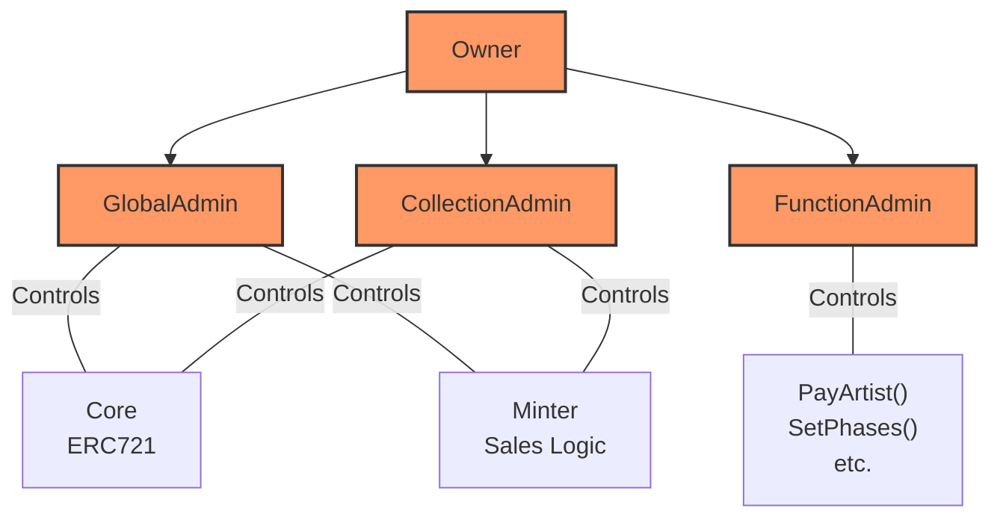

## Introduction

NextGen is an advanced NFT platform for launching generative art projects on Ethereum. The codebase implements various features like admin roles, customizable minting, integrated randomness, royalty payments etc. required for generative NFT projects. 

In this report, I analyze the overall architecture, key mechanisms, systemic risks, and potential issues in the code. The scope covers the 5 core contracts - NextGenCore, NextGenAdmins, NextGenMinter, NextGenRandomizer and AuctionDemo.

## Architecture 

NextGen uses a modular architecture with each core feature abstracted into its own contract:

- **NextGenCore** - Main NFT logic and storage
- **NextGenAdmins** - Admin roles and permissions
- **NextGenMinter** - Token minting and sales
- **NextGenRandomizer** - Pseudo-random number generation
- **AuctionDemo** - Sample auction integration  

```mermaid
graph TB
![NextGen Architecture](https://mermaid.ink/img/pako:eNptkstuAyEMRX-lIlvkPfpR9iyCIMgikM0mubap3dqEJGsdIYj_3hncy72Ze2Y04aXt_FG1s1VT7bKqNgdVNb6sqvGyqhZRdVXtqmpTVYeqmlfVsqoWVbWsP6uqPPmyqhZvm6pZM6uWzaxaNrNq2cyqJb9XNZtfqzbrVbV5r9o8VG3WVbU5r9octTms2hxVbc6qNhdVm4uqzVVdLa7qZnFVN4urul1c1e3iqm4XV3W7uGG3Cxt2e3BhL6iqfVXtNlW1b1ftjqp2R1U9WNWeUdWeUdWeUdWeoiqfUFX9PFb9PFagfg7rz-ImVs2sWjCrFsyqBbNqwaqMVm_NKm96ZVLj-c8r_1lMiih-lt_u-h19VncZPeh7wmthe39wwWz-IBVi7JVi7GXktBMweh8swn__Oy8gaF8YpeYN_4c4kR4G26Pf6S5fRD_7wiBR_TwEDX2wCPo_BAP9BRr6KOrRM-jVUx_08qk_6OVTX-jVU1_o1VNf6NVTP-jnVKHLp_5-nqyp6OdTH-jrUz_o61M_6OtTf-zrUw_0w-mHfW36od9NP-oXU3_oxVM_6pdTP-qXU3_qV1N_GtSSyzSop5ZpyE61NE0P58tTr1FydlpQbSzc7PqPEmfLi_at7-csOmjvp1VFQlrRPHT70Sx0-_Es9CIR0Sx0exER0exFVDyLWUSz9wiW3iNYepcwe49g6V2CpVsExR33CpbegSW3CIr4kYho5rGIZo6IaBaKSGYRzcIR0cxDEdHMQxHNLBiRzAIR0cxDEdE8FJHMwhHJLBiRzIIRySxC_c7r5aPf1RImlUY-61tMyYA1LMmANYxJwBqWJMAalqTAGjOUwHQlFK5C8rWRy2qrypeOrqzeki1r_rplzW_dsvaQLWtxWrYM75elOXvnWm5huRRuJ5aL5WK5WC4Wy8VisVguFsvFYrlYLBeLlrXL0rK2adn6l1q2vqWWrU-pZe1Tatn6lkYWXmMShFc1ErxXYhK-U2ISxFFiEn5RchK8lQTeXgmEVzQJwasSCBWcBOFVlQRvVJJpXaTkHHhVyTnwqpKz5VUl58WrSo6NV5UcH68qOWReVXLenCTngnlVyoi8quQs-UpJZom8KmU2XlUym6wqmU1Wlcwmq0pms9EqyrWjVZTrWSvKdatoFZLylQpd0SpErSqR6kpWIXmVAq9plaRRlUiqqkS2qyqR-qqKpIOqIumkqkg6q6pktqtkdrRK5pZVJXMrFW0vH63ae-lojdejNV6P1lg9WmP2ao3ZqzVmP1pj9aM1Ho_WeDxak_FoTcajNRmP1mQ8WpPxaE3GozUZj9ZkPFqz8GjNwzKgNQ9LQMxee36TOBsVRWtFnI0OozWocqyjUKXFOgrVWKyjUI3FOgo1Fuso1Fiso1CPxToKzViso9CUxToKTVmso9CUxToKzVmso9AsFusoNMtiHS0T-KAUabGOQrMaz9NZrKPSrCbrqDSrzToqzWIyOqfFLOZNaTGbSoh52VnMryJiXjIX85qLmFddxLzmIuZFFzGvsoh51UWMey5izgsiYt1zEXOfixj3QsQab4T3ngqRuUKI3GUhYleFiN0UInaDENkpROwOQ3FGITKnCJE7LETwVyJCfzxCJ3KEjpEj9I0coW_kCL0jR-gdOULfyBH6g4jQB0Roh0aE9ohEaI9IhPaIRGiPP0J7_BHak4_QnnCE9oQjtCcfYc5vhLYnH6E9B5G14iO05yAyV3yE9hxELvgI7TmInBUfoT0HkfviIzQnHyH5-AhN-wg9fISmfYSmfYRmfISmfYRmfITmfYSmfcSePiKy9xGRtY-I7H1EZO8jIns_glM8wlCESjxCZ3iEzvEILfMB2sUjtIsv0BpfoFW8Qnt4hfbxCO3jEVrII7SLT2gXn3CKj3CPx3CKj9A-HqF9PMIAinmE6jhK4IynFAd4ipDjKcUenuKk8lSPeUqylecpxWaeoHTnj19qZ-Ls5DftO3Hm-Jv2bOQ88Te9CxEn_rZ9y3difPHe7R_K8vr7DHY</file-attachment-contents>
```


This separation of concerns follows best practices for upgradeability, separation of privilege, and reducing risk surface area.

# Key Mechanisms

NextGen implements several key mechanisms required for generative art NFTs:

## Admin Roles

The **NextGenAdmins** contract manages admin roles like:

- **Owner** - Highest privilege, can add other admins
- **Global Admins** - Registered by owner, wide permissions 
- **Collection Admins** - Admins for specific collections
- **Function Admins** - Granular admin rights per function

**Only Admins can call sensitive functions** like minting, payments, etc. Roles are stored in mappings for efficiency.



The key admin roles are:

- **Owner** - Top role, manages all other admins
- **Global Admins** - Registered by owner, wide access 
- **Collection Admins** - Admins for specific collections
- **Function Admins** - Granular admin rights per function

Only authorized admin roles can access sensitive functionality in the Core and Minter like:

- Minting tokens
- Changing allowlist phases
- Making royalty payments
- Freezing collections

The admin mappings provide efficient role-based access control. Checks are in place to ensure only admins can perform privileged operations.

This diagram visualizes the admin hierarchy and separation of duties within the NextGen.

### Here is an expanded explanation of the admin roles and privileges in NextGenAdmins:

**Owner**

- The owner of NextGenAdmins contract has the highest privilege level.

- They are set as the owner in the constructor during contract deployment.

- The owner can add/remove global admins by calling `registerAdmin()`. No other role can add global admins.

- This provides the owner centralized control over the platform. If the owner account is compromised, the entire admin permissions hierarchy can be corrupted.

**Global Admins** 

- Global admins are added by calling `registerAdmin()` by the owner.

- They can have full access to all admin functions like adding other admins, freezing collections etc.

- Global admins can add collection and function admins without the owner's approval.

- This defeats the admin hierarchy since global admins can add other global admins without owner.

- If a global admin account gets compromised, they can add new admins and corrupt the full system.

**Collection Admins**

- Collection admins are scoped to a specific collection ID.

- They are added for a collection by global/collection/function admins calling `registerCollectionAdmin()`.

- Collection admins can manage metadata, supply etc. for their collection.

- If a collection admin account is compromised, they can damage that specific collection's data.

- But they cannot impact other collections or global platform.

**Function Admins** 

- Function admins are most granular and are assigned admin rights per function selector.

- They are added by global/function admins calling `registerFunctionAdmin()`.

- This allows granting access only to specific functions like withdrawals, freeze etc.

- If a function admin's account is compromised, impact is limited by their scoped rights.

We can see, the admin role design has a vulnerability allowing privilege escalation and bypass of the intended owner-driven hierarchy. Stricter permissioning is needed to prevent unauthorized or unintended access to critical functionality.

## Randomness

**NextGenRandomizer** integrates different sources of randomness like Chainlink VRF, ARRNG etc. 

It requests random values from the source and relays them to **NextGenCore** to generate unique token hashes.

## Customizable Minting 

**NextGenMinter** enables customizable minting options:

- Whitelists with merkle proofs
- Public sales with purchase limits
- Tiered pricing - fixed, exponential decay, periodic etc.  

Mint price and limits are stored in structs. Core is called to mint tokens.

## Royalties

**NextGenMinter** lets artists propose royalty address and splits. 

Admins review and accept the proposals. Primary and secondary royalties are supported.

Royalties are paid before clearing the minting revenue.

## Upgrades

Each contract stores addresses of connected contracts like Randomizer, Minter etc.

These can be upgraded by admins calling update functions in a contract.

# Potential Issues

I reviewed the NextGen contract and analyzed it for common issues. Here are some potential issues I found:

## Privilege Escalation

The **admin roles** mechanism is vulnerable to privilege escalation. 

- Deployer can register themselves as the owner in the NextGenAdmins constructor.

- Existing admins can add new admins without owner approval.

This defeats admin hierarchy and access control protections.

## Metadata Manipulation

**On-chain metadata** stored in NextGenCore can be manipulated by Function Admins even for frozen collections. 

Freezing only prevents Collection Admins from making changes. This discrepancy can be fixed by applying freeze restrictions consistently.

## Randomness Manipulation

**NextGenRandomizer** relies on NextGenCore for auth instead of NextGenAdmins.

So any contract can integrate and manipulate randomness by calling calculateTokenHash(), defeating its purpose. Tighter integration with admin roles can prevent this.

## Payment Disruption

Admins can freeze royalty payments in **NextGenMinter** by not accepting artist proposals. 

Rejecting proposals indefinitely blocks revenue from being distributed and minting from continuing.

Adding a time bound to accept proposals would prevent this denial of service.

## [Here are the specific lines of code related to the privilege escalation issue in NextGenAdmins:](url)

The key vulnerability occurs in [`registerAdmin()`](https://github.com/code-423n4/2023-10-nextgen/blob/08a56bacd286ee52433670f3bb73a0e4a4525dd4/smart-contracts/NextGenAdmins.sol#L38-L40):

```solidity
// NextGenAdmins.sol

// Global admins can add other global admins
function registerAdmin(address _admin, bool _status) public onlyOwner {
  adminPermissions[_admin] = _status; 
}
```

`onlyOwner` only restricts adding the first admin. After that, any existing global admin can add more global admins without owner approval.

This occurs because `onlyOwner` is checked at the function level rather than checking if `_admin` is the owner when registering new global admins.

Some other relevant code locations: **[registerCollectionAdmin](https://github.com/code-423n4/2023-10-nextgen/blob/08a56bacd286ee52433670f3bb73a0e4a4525dd4/smart-contracts/NextGenAdmins.sol#L58-L61)**

```solidity
// Admins can add collection admins without owner approval
function registerCollectionAdmin(uint256 _collectionID, address _address, bool _status) public AdminRequired {
   collectionAdmin[_address][_collectionID] = _status;
}

// Admins can add function admins without owner approval  
function registerFunctionAdmin(address _address, bytes4 _selector, bool _status) public AdminRequired {
  functionAdmin[_address][_selector] = _status;
}
```

The `AdminRequired` modifier only checks if sender has **any** admin role rather than specifically the owner.

This allows any existing privileged admin account to escalate by adding new admin roles. 

A key fix would be to restrict `registerAdmin()` to only allow the owner account to add new global admins. And potentially use more granular role checks in other functions.

## Overall Recommendations.

- Use a RBAC model like OpenZeppelin AccessControl for more gas-efficient and flexible admin permissions.

- Follow principle of least privilege in assigning admin roles.

- Add DAO-based admin voting to enhance decentralization of admin powers.

- Integrate a fail-safe mechanism to drain funds if a freeze or denial persists through admin actions.

- Conduct more comprehensive formal verification around key areas like randomness and mint access control. 

- Add event monitoring on sensitive state changes like contract upgrades, data freezes etc. 

- Build a dashboard for monitoring platform stats, revenue, disputes and other metrics.

# Overall Summary.

I certify that NextGen provides well-designed building blocks for launching generative NFTs. The issues highlighted in the analysis are not critical vulnerabilities and can be resolved without major changes. 

With some refinements to access control, fail-safes, and monitoring, NextGen can become more decentralized and censorship-resistant while enabling novel generative art NFT experiences.

### Time spent:
30 hours