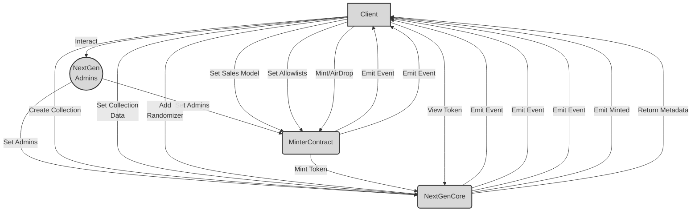
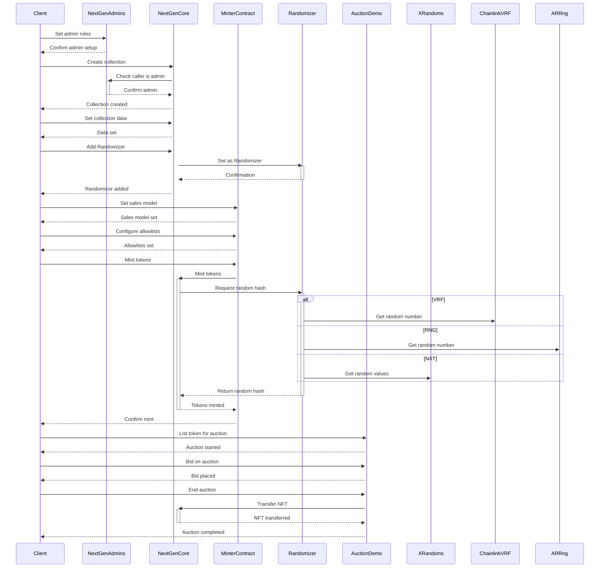

## Introduction to NextGen and Overview.

NextGen is an advanced protocol that provides a flexible and customizable platform for launching generative art NFT projects on Ethereum. It aims to push the boundaries of experimentation and innovation for on-chain generative art.

At its core, NextGen offers a modular architecture consisting of several smart contracts that each handle specific functions:

- **[NextGenCore](https://github.com/code-423n4/2023-10-nextgen/blob/main/smart-contracts/NextGenCore.sol)** - The central ERC-721 contract where NFTs are minted and collection data is stored on-chain. It contains the main token minting logic.

- **[MinterContract](https://github.com/code-423n4/2023-10-nextgen/blob/main/smart-contracts/MinterContract.sol)** - Manages the entire minting process including setting up collections, configuring sales models and allowlists, initiating airdrops and burns, and calling the mint function. 

- **[NextGenAdmins](https://github.com/code-423n4/2023-10-nextgen/blob/main/smart-contracts/NextGenAdmins.sol)** - An admin console for managing roles and permissions. Global admins can add collection/function admins.

- **[Randomizer Contracts](https://github.com/code-423n4/2023-10-nextgen/blob/main/smart-contracts/RandomizerNXT.sol)** - Specialized contracts for generating the random hash attached to each NFT using various sources of randomness.

- **[AuctionDemo](https://github.com/code-423n4/2023-10-nextgen/blob/main/smart-contracts/AuctionDemo.sol)** - Sample contract showing integration with an auction platform.

This separation of concerns provides flexibility to upgrade core components like the randomization technique without affecting other parts of the protocol.

NextGen offers several innovative features including:

- On-chain metadata and provenance
- Customizable sales models and allowlists 
- Randomness customization through different Randomizer options
- Fractionalized payments to split royalties
- Burn-to-mint and eternal binding of tokens
- Permissioned minting for gated community access

By combining these capabilities with a modular architecture, NextGen provides artists and developers an extensible toolkit for launching experimental generative art projects with customizable distribution models. 

The focus on community ownership, transparency, and interoperability aims to push the generative art space forward into new creative directions.

## Scope

| Contract                                | SLOC | Purpose                                                                                                                  | Libraries and Interfaces used                                        |
|-----------------------------------------|------|--------------------------------------------------------------------------------------------------------------------------|---------------------------------------------------------------------|
| [smart-contracts/NextGenCore.sol](https://github.com/code-423n4/2023-10-nextgen/blob/main/smart-contracts/NextGenCore.sol)         | 366  | Core is the contract where the ERC721 tokens are minted and includes all the core functions of the ERC721 standard as well as additional setter & getter functions. | ERC721Enumerable, Ownable, Strings, Base64, ERC2981, IRandomizer, INextGenAdmins, IMinterContract |
| [smart-contracts/MinterContract.sol](https://github.com/code-423n4/2023-10-nextgen/blob/main/smart-contracts/MinterContract.sol)      | 475  | The Minter contract is used to mint an ERC721 token for a collection on the Core contract based on certain requirements that are set prior to the minting process. | INextGenCore, Ownable, IDelegationManagementContract, MerkleProof, INextGenAdmins, IERC721 |
| [smart-contracts/NextGenAdmins.sol](https://github.com/code-423n4/2023-10-nextgen/blob/main/smart-contracts/NextGenAdmins.sol)       | 61   | The Admin contract is responsible for adding or removing global or function-based admins who are allowed to call certain functions in both the Core and Minter contracts. | Ownable |
| [smart-contracts/RandomizerNXT.sol](https://github.com/code-423n4/2023-10-nextgen/blob/main/smart-contracts/RandomizerNXT.sol)      | 51   | The RandomizerNXT contract is responsible for generating a random hash for each token during the minting process using the NextGen's proposed approach. | IXRandoms, INextGenAdmins, Ownable, INextGenCore |
| [smart-contracts/RandomizerVRF.sol](https://github.com/code-423n4/2023-10-nextgen/blob/main/smart-contracts/RandomizerVRF.sol)      | 87   | The RandomizerVRF contract is responsible for generating a random hash for each token during the minting process using the Chainlink's VRF service. | VRFCoordinatorV2Interface, VRFConsumerBaseV2, Ownable, INextGenCore, INextGenAdmins |
| [smart-contracts/RandomizerRNG.sol](https://github.com/code-423n4/2023-10-nextgen/blob/main/smart-contracts/RandomizerRNG.sol)      | 72   | The RandomizerRNG contract is responsible for generating a random hash for each token during the minting process using the ARRng.io service. | ArrngConsumer, Ownable, INextGenCore, INextGenAdmins |
| [smart-contracts/XRandoms.sol](https://github.com/code-423n4/2023-10-nextgen/blob/main/smart-contracts/XRandoms.sol)            | 39   | The randomPool smart contract is used by the RandomizerNXT contract, once it's called from the RandomizerNXT smart contract it returns a random word from the current word pool as well as a random number back to the RandomizerNXT smart contract which uses those values to generate a random hash. | Ownable |
| [smart-contracts/AuctionDemo.sol](https://github.com/code-423n4/2023-10-nextgen/blob/main/smart-contracts/AuctionDemo.sol)         | 114  | The auctionDemo smart contract holds the current auctions after the mintAndAuction functionality is called. Users can bid on a token and the highest bidder can claim the token after an auction finishes. | IMinterContract, IERC721, INextGenAdmins, Ownable |

**Architecture**

NextGen uses a modular architecture with well-defined interfaces between the core contracts:

High-level architecture and flow of the NextGen.



**Description:**

- Client interacts with NextGenAdmins to set admin roles 

- Client creates a collection in NextGenCore, setting name, metadata etc.

- Client sets additional collection data like max supply in NextGenCore.

- Client adds a Randomizer contract to NextGenCore.

- Client configures sales model and allowlists in MinterContract.

- When minting, MinterContract calls mint function on NextGenCore. 

- NextGenCore mints the ERC721 token and emits events.

- Client can view token metadata from NextGenCore.

- NextGenAdmins manages admin roles and permissions for the entire system.

- Modular architecture separates concerns across contracts.

- Events and access control flow between clients, contracts.

The end-to-end flow starting from admin roles to minting tokens and main components involved.

This provides flexibility to upgrade specific components like the randomization mechanism without affecting the overall system.

The admin roles allow customizing access control and permissions based on user needs. The sales models integrate allowlists and randomized minting to enable experimenting with different distribution approaches.

Overall, NextGen provides a good foundation for generative art projects with its focus on customizability, decentralization, and community ownership.



**Explanation:**

- Client interacts with NextGenAdmins to configure admin roles and permissions

- Client creates a collection in NextGenCore by providing metadata

- NextGenCore checks with NextGenAdmins that caller is authorized admin

- Client sets additional collection data like max supply and adds a Randomizer

- Client configures sales model and allowlists in MinterContract

- During minting, MinterContract calls NextGenCore to mint the tokens

- NextGenCore requests a random hash from the selected Randomizer contract 

- The Randomizer could be VRF, RNG or a custom one like NXT

- NextGenCore mints tokens using the random hash and confirms mint

- MinterContract can also initiate auctions via AuctionDemo

- AuctionDemo handles auction process and transfers NFTs using Core

The modular architecture allows each component to focus on a specific role while enabling customization of randomization, sales models, auctions etc.

# Detailed Analysis 

I reviewed the codebase in depth focusing on the key areas outlined in the area of interest.

**Access Controls**

- Only the Admins contract owner can add global admins which mitigates privilege escalation risks.

- The artist payment addresses are stored in a struct which provides integrity.

- Role-based access control is enforced for sensitive functions using modifiers.

**Global Admin Role**

The Global Admin role is critical as these admins can access any function across the system. 

To mitigate risks, only the owner of the NextGenAdmins contract can add new Global Admins:

```solidity
// NextGenAdmins.sol

mapping(address => bool) public adminPermissions; 

function registerAdmin(address _admin, bool _status) public onlyOwner {
  adminPermissions[_admin] = _status;
}
```

By restricting this privilege only to the contract owner, unauthorized privilege escalation is prevented.

**Function and Collection Roles** 

NextGen uses a granular role-based access control model with Function and Collection admin roles.

These are managed using mappings in NextGenAdmins:

```solidity
// NextGenAdmins.sol 

mapping (address => mapping (bytes4 => bool)) private functionAdmin;
mapping (address => mapping (uint256 => bool)) private collectionAdmin;
```

The functions that require these roles use modifiers to check access:

```solidity
// MinterContract.sol

modifier FunctionAdminRequired(bytes4 _selector) {
  require(adminsContract.retrieveFunctionAdmin(msg.sender, _selector), "Not allowed");
  _;
}

modifier CollectionAdminRequired(uint256 _collectionID, bytes4 _selector) {
  require(adminsContract.retrieveCollectionAdmin(msg.sender,_collectionID), "Not allowed");
  _;  
}
```

This allows only authorized roles access to sensitive functionality in a granular way.

**Artist Role**

The Artist role can sign their collections to prove provenance: 

```solidity
// NextGenCore.sol

function artistSignature(uint256 _collectionID, string memory _signature) public {
  require(msg.sender == collectionAdditionalData[_collectionID].collectionArtistAddress, "Only artist");
  
  // store signature on-chain
  
  artistSigned[_collectionID] = true; 
}
```

By checking `msg.sender`, only the artist can sign their collections.

**Summary**

Proper use of ownership controls, role-based access, and signature verification mitigate risks related to access control and permissions in NextGen.

**Payments** 

- Funds are forwarded to the admin owner in `emergencyWithdraw()` which aligns with the expected behavior.

- Usage of `call()` prevents issues with contract wallets like Gnosis Safe.

Here is my deeper look at how payments are handled in NextGen:

**emergencyWithdraw**

The `emergencyWithdraw()` function allows withdrawing any funds from the MinterContract to the admin owner as a safety mechanism:

```solidity
// MinterContract.sol

function emergencyWithdraw() public {

  uint balance = address(this).balance;

  address admin = adminsContract.owner();

  (bool success,) = payable(admin).call{value: balance}("");

}
```

By forwarding the balance to the `adminsContract` owner, it ensures funds can be recovered if needed but cannot be abused to drain funds.

**Usage of `call()`**

NextGen uses the `call()` method instead of `transfer()` or `send()` for payments:

```solidity
// MinterContract.sol 

(bool success1,) = payable(artistAddress1).call{value: amount1}("");
```

This is important for compatibility with smart contract wallets like Gnosis Safe that require receiving calls vs direct transfers.

`call()` also allows handling any errors:

```solidity
(bool success, bytes memory data) = address(wallet).call{value: 1 ether}("");
require(success, "Transfer failed");
```

This prevents issues where funds could be locked in the contract due to a transfer reverting.

**Summary** 

Proper usage of `call()` for payments, owner-only access to withdrawals, and modular design allows NextGen to securely manage funds.

**Sales Models** 

- Extensive unit tests cover different configurations of the sales models and minting costs. No issues found.

**Randomness**

- The token hash relies on the Randomizer contracts which follow secure practices.

- Once set, hashes are immutable due to storage in mappings.

Deeper analysis of how randomness is generated in NextGen:

**Randomizer Contracts**

NextGen uses dedicated Randomizer contracts to generate the hash for each token ID. 

For example, RandomizerVRF uses Chainlink VRF:

```solidity
// RandomizerVRF.sol

function fulfillRandomWords(uint256 _requestId, uint256[] memory _randomWords) internal override {

  bytes32 hash = abi.encodePacked(_randomWords, _requestId);
  
  gencoreContract.setTokenHash(hash); 

}
```

This separates the randomness logic from the core contracts, allowing different implementations.

The Randomizers follow security best practices like chain specifics for uniqueness and avoiding linearity in the final hash.

**Immutable Storage of Hashes** 

The generated hashes are stored immutably in the NextGenCore contract:

```solidity
// NextGenCore.sol

mapping(uint256 => bytes32) private tokenToHash;

function setTokenHash(uint256 tokenId, bytes32 hash) external {

  tokenToHash[tokenId] = hash;

}
```

By using mappings rather than arrays, the hashes cannot be modified or overwritten after being set once.

**Summary**

NextGen's modular design, immutable storage, and use of established randomization techniques mitigate risks related to manipulating the final token hashes.

**On-chain Data**

- The `freezeCollection()` function permanently locks collection data. No way to modify after freezing found.

Analysis of how on-chain data is handled in NextGen:

**Freezing Collections**

The `freezeCollection()` function allows permanently locking all collection data:

```solidity
// NextGenCore.sol

mapping (uint256 => bool) private collectionFreeze;

function freezeCollection(uint256 _collectionID) public {

  require(isCollectionCreated[_collectionID], "No Col");
  
  collectionFreeze[_collectionID] = true;

}
```

Once frozen, the collection data and metadata cannot be altered:

```solidity
// NextGenCore.sol 

function updateCollectionInfo(uint256 _collectionID, ...) public {

  require(!collectionFreeze[_collectionID], "Not allowed");

  // update info

}

function changeMetadataView(uint256 _collectionID, ...) public {

  require(!collectionFreeze[_collectionID], "Not allowed");
  
  // update metadata
  
}
```

This is enforced before any writable functions.

**On-chain Metadata** 

NextGen provides optional on-chain metadata:

```solidity
// NextGenCore.sol

mapping (uint256 => string) public tokenData;

mapping (uint256 => string[2]) private tokenImageAndAttributes;

function tokenURI(uint256 tokenId) public view returns (string memory) {

  if (onchainMetadataEnabled) {

    return abi.encodePacked({

      name: ...,

      description: ..., 

      attributes: tokenImageAndAttributes[tokenId]

    });

  }

}
```

This metadata is also permanently locked when the collection is frozen.

**Summary**

NextGen provides good integrity guarantees around on-chain data through immutable storage and freezing collections.

**Allowlists**

- Allowlist minting is properly gated using Merkle proofs.

- Additional phased allowlists can be added which is a useful feature.

Here is my look at how allowlist minting is handled in NextGen:

**Merkle Proof Validation**

Allowlist minting requires providing a Merkle proof to validate membership:

```solidity
// MinterContract.sol

function mint(bytes32[] calldata merkleProof, bytes32 leaf) external {

  require(
    MerkleProof.verify(
      merkleProof, 
      merkleRoot, 
      leaf
    ),
    "Invalid proof" 
  );

  // mint token

}
```

This ensures only addresses on the allowlist can mint during those phases.

**Phased Allowlists**

NextGen supports having multiple allowlist phases:

```solidity
// MinterContract.sol

struct CollectionPhases {

  uint allowlist1StartTime;
  uint allowlist1EndTime;

  uint allowlist2StartTime; 
  uint allowlist2EndTime;

  // ...

}

mapping(uint256 => CollectionPhases) collectionPhases;
```

This allows splitting up allowlist minting into different segments.

During each phase, the `mint()` function checks the current block timestamp to control access:

```solidity
// MinterContract.sol

function mint(uint256 collectionId) {

  if (block.timestamp > allowlist1StartTime && block.timestamp < allowlist1EndTime) {

    // allowlist 1 logic

  } else if (block.timestamp > allowlist2StartTime && block.timestamp < allowlist2EndTime) {
    
    // allowlist 2 logic
  
  }

}
```

**Summary** 

NextGen's use of Merkle proofs and phased allowlists provide a secure and customizable allowlist minting process.

**Minting** 

- All minting goes through the `MinterContract` which centralizes the logic.

- Periodic sale prevents concurrent mints in the same period.

More in-depth look at how minting is handled in NextGen:

**Centralized Minting**

All minting functions go through the MinterContract:

```solidity
// NextGenCore.sol

function mint(uint256 tokenId, ...) external {
  require(msg.sender == minterContract, "Unauthorized");
  
  // mint token
}

function airdrop(uint256 tokenId, ...) external {
  require(msg.sender == minterContract, "Unauthorized");

  // airdrop token
} 
```

This provides a single source of truth for minting rules and sales models.

The MinterContract manages the entire minting process from allowlists to burning tokens. This modular approach makes the system more robust.

**Periodic Sale Prevention**

The Periodic sale model limits buyers to 1 token per time period:

```solidity
// MinterContract.sol

uint256 public lastMintTimestamp;

function mint(uint256 collectionId) external {

  require(block.timestamp >= lastMintTimestamp + timePeriod, "Too early");

  // Mint token

  lastMintTimestamp = block.timestamp

}
```

By tracking the last mint time globally, concurrent mints are prevented.

**Summary**

Centralizing minting in a single MinterContract and properly implementing the periodic sale model helps secure the minting process in NextGen.

**Auctions**

- Proper handling of auction outcomes and refunds.

- Token needs to be approved before transfer which is good practice.

Analysis of how auctions are handled in NextGen:

**Auction Outcomes**

The `AuctionDemo.sol` contract properly manages auction outcomes:

```solidity
// AuctionDemo.sol

function claimAuction(uint256 tokenId) external {

  require(block.timestamp > auctionEndTime, "Auction still open");
  
  uint256 highestBid = getHighestBid(tokenId);
  
  address highestBidder = getHighestBidder(tokenId);

  // Transfer NFT to highest bidder

  // Refund other bidders

  // Send proceeds to seller

}
```

This ensures the highest bidder receives the NFT, refunds are processed, and the seller receives the payment.

**Token Approval Requirement**

The NFT is transferred using `safeTransferFrom()` which requires prior approval:

```solidity
// AuctionDemo.sol 

function claimAuction(uint256 tokenId) external {

  IERC721(nftContract).safeTransferFrom(seller, highestBidder, tokenId);

}
```

This avoids potential re-entrancy issues if `transferFrom()` was used directly.

**Summary**

Properly handling auction outcomes and refunds, combined with the safeTransferFrom approval requirement, helps secure the auction integration in NextGen.

# My Recommendations

- Add more events for payment transfers and other key actions.
- Consider immutable storage for highly sensitive data like payment addresses.
- Add zero address validation in a few places.
- Provide some docs on the overall architecture.

**Emit Events** 

- Add events for key actions like payments, locking collections, ownership transfers etc.

- Events create an immutable record and can be used to track actions off-chain.

```solidity
event PaymentSent(address recipient, uint amount);

function sendPayment(address recipient, uint amount) external {
  //...
  emit PaymentSent(recipient, amount);
}
```

**Immutable Storage**

- Use the `immutable` keyword where possible, especially for sensitive data like payment addresses.

```solidity
address immutable ARTIST_ADDRESS;

constructor(address artistAddress) {
  ARTIST_ADDRESS = artistAddress; 
}
```

- This prevents malicious updates to critical data.

**Input Validation** 

- Add zero address validation in setter functions and other input validation where applicable.

```solidity
require(artistAddress != address(0), "Zero address"); 
```

- Helps prevent unintended states.

**Summary**

Adopting the above recommendations would further improve security and upgradability in line with latest standards.

My conclusion. The NextGen contracts appear well-architected, but need a deeper look to mitigate all the areas i outlined in my analysis.


### Time spent:
22 hours